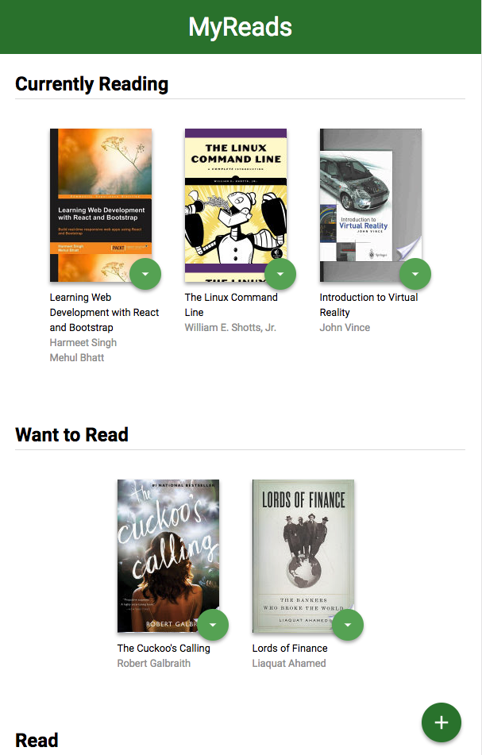

# MyReads Project (By Htun Htun Htet)

The following project is build for Udacity React Nano Degree Program first assignment, which show how much understand
about React basci structure and Operation of a React - base App.

## How to run project

The project uses Node.js and the Create-React-App starter.  If you do not have Node >= 6.x installed, you can download it here: [Node.js](https://nodejs.org/en/)

Once Node is installed, navigate to the directory where you want to store the application.

```
git clone https://github.com/HtunHtunHtet/reactnd-project-myreads-starter.git
npm install
npm install --save react react-debounce-input
npm install --save react-router-dom
npm start
```

After perform ```npm install``` , it should automatically open ```http://localhost:3000/``` inside your browser. 
If it does not open by any chance, please navigate to ```http://localhost:3000/```. The following screen shot should appear.



##Using Applications

There is total of 3 categories in this applications, which are
1. currently reading.
2. want to read and 
3. read

##Chainging Shelf
In each book of categories, there is a drop down button at bottom right corner, click it and
book shelf changing function will appear. 


After changed book shelf , it should disappear  from the current book shelf and updated to designated shelf. 
After page is reloaded, books should be put inside respective book shelf without returning pervious state.

 ##Searching Books
 In order to search book, you can either go directly to ```/search``` route clicking ```+```
 at the very right bottom of the screen. 
 
 Once you reach ```search``` page, you can search with the following keywords (provided from udcaity)
 
 
 
 
 You can also change book shelf inside the search page and it should reflect in book shelf as well. 
 
 


##Search Terms For Search Bar
'Android', 'Art', 'Artificial Intelligence', 'Astronomy', 'Austen', 'Baseball', 'Basketball', 'Bhagat', 'Biography', 'Brief', 'Business', 'Camus', 'Cervantes', 'Christie', 'Classics', 'Comics', 'Cook', 'Cricket', 'Cycling', 'Desai', 'Design', 'Development', 'Digital Marketing', 'Drama', 'Drawing', 'Dumas', 'Education', 'Everything', 'Fantasy', 'Film', 'Finance', 'First', 'Fitness', 'Football', 'Future', 'Games', 'Gandhi', 'History', 'History', 'Homer', 'Horror', 'Hugo', 'Ibsen', 'Journey', 'Kafka', 'King', 'Lahiri', 'Larsson', 'Learn', 'Literary Fiction', 'Make', 'Manage', 'Marquez', 'Money', 'Mystery', 'Negotiate', 'Painting', 'Philosophy', 'Photography', 'Poetry', 'Production', 'Program Javascript', 'Programming', 'React', 'Redux', 'River', 'Robotics', 'Rowling', 'Satire', 'Science Fiction', 'Shakespeare', 'Singh', 'Swimming', 'Tale', 'Thrun', 'Time', 'Tolstoy', 'Travel', 'Ultimate', 'Virtual Reality', 'Web Development', 'iOS'

This project is licensed under the terms of the MIT license.